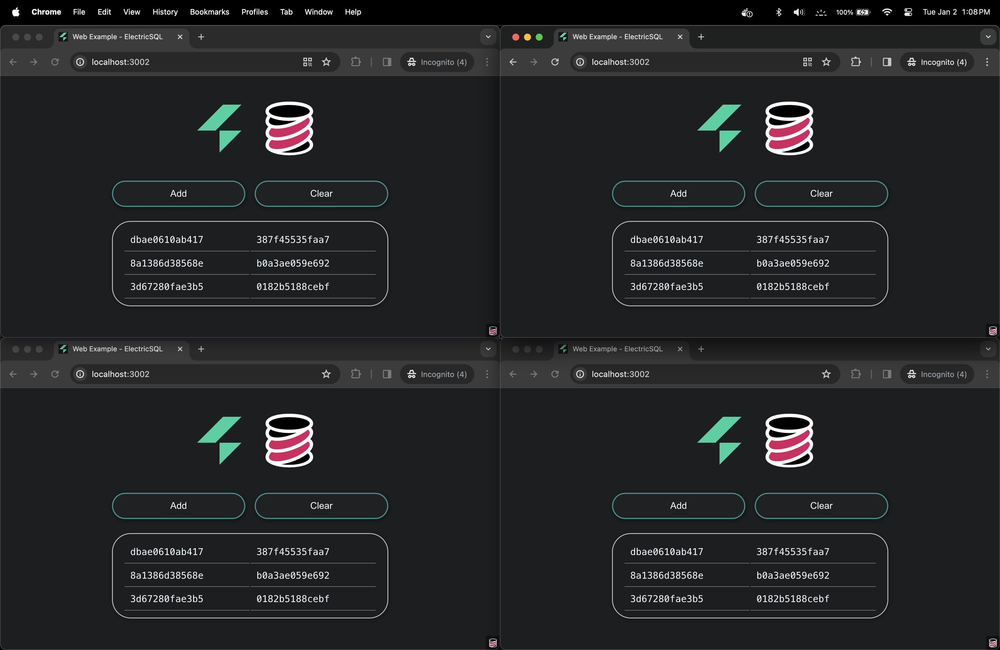

# tinybase-ts-react-electricsql

This is a template for a simple [TinyBase](https://tinybase.org/) app, using
TypeScript, React, and ElectricSQL.

It is a fork of the [ElectricSQL web
example](https://github.com/electricsql/electric/tree/main/examples/web-wa-sqlite)
app, with small changes to introduce TinyBase into the view layer. All the
credit for the magic goes to ElectricSQL!



## Instructions

1. Make a copy of this template into a new directory:

```sh
npx degit tinyplex/tinybase-ts-react-electricsql my-tinybase-app
```

2. Go into the directory:

```sh
cd my-tinybase-app
```

3. Install the dependencies:

```sh
npm install
```

Note that you will also need to install [Docker](https://docs.docker.com/engine/install/).

4. Start Postgres and Electric using Docker:

```sh
npm run backend:up
```

5. Setup the database schema:

```sh
npm run db:migrate
```

6. Generate the type-safe client:

```sh
npm run client:generate
```

7. Run the server:

```sh
npm run start
```

8. Go the URL shown and enjoy!

## Other templates

There are seven templates for TinyBase, of which this is one:

|     | Template                                                                                       | Language   | React | Plus        |
| --- | ---------------------------------------------------------------------------------------------- | ---------- | ----- | ----------- |
|     | [vite-tinybase](https://github.com/tinyplex/vite-tinybase)                                     | JavaScript | No    |             |
|     | [vite-tinybase-ts](https://github.com/tinyplex/vite-tinybase-ts)                               | TypeScript | No    |             |
|     | [vite-tinybase-react](https://github.com/tinyplex/vite-tinybase-react)                         | JavaScript | Yes   |             |
|     | [vite-tinybase-ts-react](https://github.com/tinyplex/vite-tinybase-ts-react)                   | TypeScript | Yes   |             |
|     | [vite-tinybase-ts-react-crsqlite](https://github.com/tinyplex/vite-tinybase-ts-react-crsqlite) | TypeScript | Yes   | CR-SQLite   |
|     | [tinybase-ts-react-partykit](https://github.com/tinyplex/tinybase-ts-react-partykit)           | TypeScript | Yes   | PartyKit    |
| 👉  | [tinybase-ts-react-electricsql](https://github.com/tinyplex/tinybase-ts-react-electricsql)     | TypeScript | Yes   | ElectricSQL |

## License

This template is forked from an ElectricSQL example that has an Apache-2
license. [TinyBase](https://github.com/tinyplex/tinybase/blob/main/LICENSE) is
MIT licensed.
